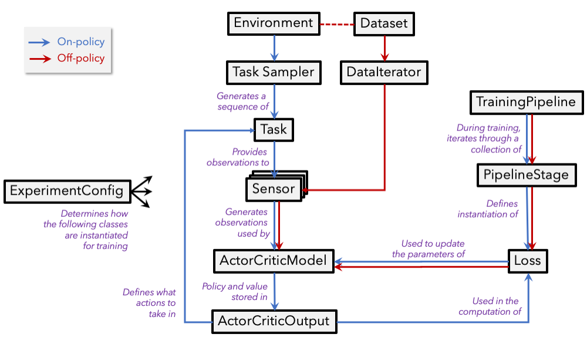

# Primary abstractions

Our package relies on a collection of fundamental abstractions to define how, and in what task, an agent should be
trained and evaluated. A subset of these abstractions are described in plain language below. Each of the below sections
end with a link to the (formal) documentation of the abstraction as well as a link to an example implementation of the
abstraction (if relevant). The following provides a high-level illustration of how these abstractions interact.

## Experiment configuration

In `allenact`, experiments are definied by implementing the abstract `ExperimentConfig` class. The methods
of this implementation are then called during training/inference to properly set up the desired experiment. For example,
the `ExperimentConfig.create_model` method will be called at the beginning of training to create the model
to be trained.
See either the ["designing your first minigrid experiment"](/tutorials/minigrid-tutorial) or the
["designing an experiment for point navigation"](/tutorials/training-a-pointnav-model)
 tutorials to get an in-depth description of how these experiment configurations are defined in practice.

See also the [abstract `ExperimentConfig` class](/api/core/base_abstractions/experiment_config#experimentconfig) 
and an [example implementation](/api/projects/tutorials/minigrid_tutorial#MiniGridTutorialExperimentConfig).

## Task sampler

A task sampler is responsible for generating a sequence of tasks for agents to solve. The sequence of tasks can be 
randomly generated (e.g. in training) or extracted from an ordered pool (e.g. in validation or testing).

See the [abstract `TaskSampler` class](/api/core/base_abstractions/task/#tasksampler) 
and an [example implementation](/api/plugins/ithor_plugin/ithor_task_samplers/#objectnavtasksampler).

## Task

Tasks define the scope of the interaction between agents and an environment (including the action types agents are 
allowed to execute), as well as metrics to evaluate the agents' performance. For example, we might define a task 
`ObjectNavTask` in which agents receive observations obtained from the environment (e.g. RGB images) or directly from 
the task (e.g. a target object class) and are allowed to execute actions such as `MoveAhead`, `RotateRight`, 
`RotateLeft`, and `End` whenever agents determine they have reached their target. The metrics might include a
success indicator or some quantitative metric on the optimality of the followed path.  

See the [abstract `Task` class](/api/core/base_abstractions/task/#task) 
and an [example implementation](/api/plugins/ithor_plugin/ithor_tasks/#objectnavtask).

## Sensor

Sensors provide observations extracted from an environment (e.g. RGB or depth images) or directly from a task (e.g. the 
end point in point navigation or target object class in semantic navigation) that can be directly consumed by 
agents.

See the [abstract `Sensor` class](/api/core/base_abstractions/sensor/#sensor) 
and an [example implementation](/api/plugins/ithor_plugin/ithor_sensors/#rgbsensorthor).

## Actor critic model

The actor-critic agent is responsible for computing batched action probabilities and state values given the 
observations provided by sensors, internal state representations, previous actions, and potentially 
other inputs.

See the [abstract `ActorCriticModel` class](/api/core/algorithms/onpolicy_sync/policy/#ActorCriticModel) 
and an
[example implementation](/api/projects/objectnav_baselines/models/object_nav_models#ObjectNavBaselineActorCritic).

## Training pipeline

The training pipeline, defined in the
[`ExperimentConfig`'s `training_pipeline` method](/api/core/base_abstractions/experiment_config/#training_pipeline),
contains one or more training stages where different
[losses can be combined or sequentially applied](/howtos/defining-a-new-training-pipeline).
 
## Losses

Actor-critic losses compute a combination of action loss and value loss out of collected experience that can be used to 
train actor-critic models with back-propagation, e.g. PPO or A2C.

See the
[`AbstractActorCriticLoss` class](/api/core/algorithms/onpolicy_sync/losses/abstract_loss#abstractactorcriticloss) 
and an [example implementation](/api/core/algorithms/onpolicy_sync/losses/ppo/#ppo).

Off-policy losses implement generic training iterations in which a batch of data is run through a model (that can be a
subgraph of an [`ActorCriticModel`](#actor-critic-model)) and a loss is
computed on the model's output.

See the
[`AbstractOffPolicyLoss` class](/api/core/algorithms/offpolicy_sync/losses/abstract_offpolicy_loss#abstractoffpolicyloss) 
and an [example implementation](/api/plugins/minigrid_plugin/minigrid_offpolicy/#MiniGridOffPolicyExpertCELoss).
