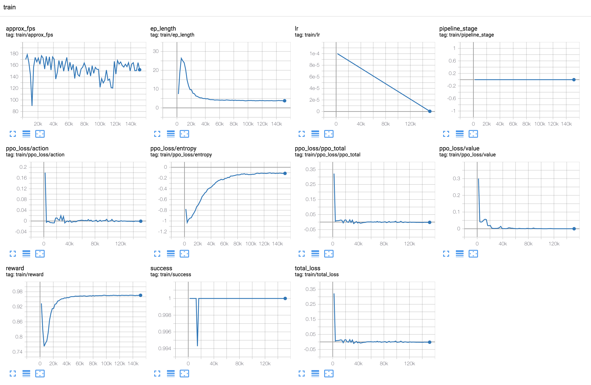

# Running your first experiment

Assuming you have [installed all of the requirements](../installation/installation-allenact.md), you can run your first experiment by calling

```bash
python main.py minigrid_tutorial -b projects/tutorials -m 8 -o minigrid_output -s 12345
```

from the project root folder.

* With `-b projects/tutorials` we set the base folder to search for the `minigrid_tutorial` experiment configuration.
* With `-m 8` we limit the number of subprocesses to 8 (each subprocess will run 16 of the 128 training task samplers).
* With `-o minigrid_output` we set the output folder.
* With `-s 12345` we set the random seed.

If everything was installed correctly, a simple model will be trained (and validated) in the MiniGrid environment and
a new folder `minigrid_output` will be created containing:

* a `checkpoints/MiniGridTutorial/LOCAL_TIME_STR/` subfolder with model weight checkpoints,
* a `used_configs/MiniGridTutorial/LOCAL_TIME_STR/` subfolder with all used configuration files,
* and a tensorboard log file under `tb/MiniGridTutorial/LOCAL_TIME_STR/`.

Here `LOCAL_TIME_STR` is a string that records the time when the experiment was started (e.g. the string 
`"2020-08-21_18-19-47"` corresponds to an experiment started on August 21st 2020, 47 seconds past 6:19pm. 

If we have Tensorboard installed, we can track training progress with
```bash
tensorboard --logdir minigrid_output/tb
```
which will default to the URL [http://localhost:6006/](http://localhost:6006/).

After 150,000 steps, the script will terminate and several checkpoints will be saved in the output folder.
The training curves should look similar to:



If everything went well, the `valid` success rate should converge to 1 and the mean episode length to a value below 4.
(For perfectly uniform sampling and complete observation, the expectation for the optimal policy is 3.75 steps.) In the
not-so-unlikely event of the run failing to converge to a near-optimal policy, we can just try to re-run (for example
with a different random seed). The validation curves should look similar to:


 
A detailed tutorial describing how the `minigrid_tutorial` experiment configuration was created designed can be found 
[here](../tutorials/minigrid-tutorial.md). 
 
To run your own custom experiment simply define a new experiment configuration in a file 
`projects/YOUR_PROJECT_NAME/experiments/my_custom_experiment.py` after which you may run it with
`python main.py my_custom_experiment -b projects/tutorials`.

<!-- ## Experiment configuration

The main entry point for users is a configuration file that defines the experiment we
want to run. More concretely, it includes a single class defining:

* A `tag` to identify the experiment.
* A method to instantiate [actor-critic models](/getting_started/abstractions#actor-critic-model).
* A multi-staged training pipeline with different types of [losses](/getting_started/abstractions#actor-critic-loss), an 
optimizer, and other parameters like learning rates, batch sizes, etc. 
* Machine configuration parameters that will be used e.g. for training or validation.
* A method to instantiate [task samplers](/getting_started/abstractions#task-sampler).
* Methods describing initialization parameters for task samplers used in training, validation, and testing; including
 the assignment of workers to devices for running environments.

A detailed view to an example experiment config file can be found [here](/overview/experiment).
 -->