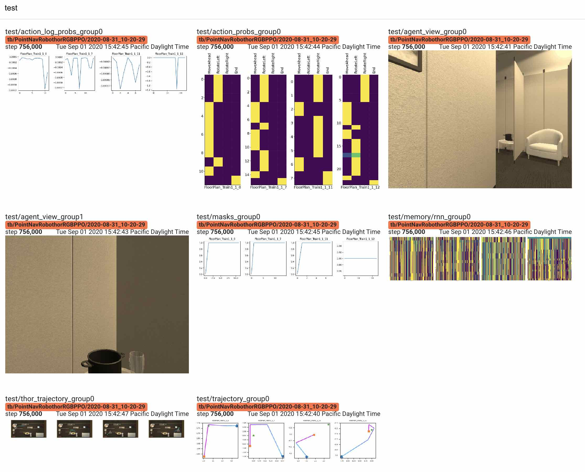

# Tutorial: Inference with a pre-trained model

In this tutorial we will run inference on a pre-trained model for the PointNav task
in the RoboTHOR environment. In this task the agent is tasked with going to a specific location
within a realistic 3D environment.

For information on how to train a PointNav Model see [this tutorial](training-a-pointnav-model.md)

We will need to [install the RoboTHOR environment](../installation/installation-allenact.md) and [download the 
RoboTHOR Pointnav dataset](../installation/download-datasets.md) before we get started.

For this tutorial we will download the weights of a model trained on the debug dataset.
This can be done with a handy script in the `pretrained_model_ckpts` directory:
```bash
bash pretrained_model_ckpts/download_navigation_model_ckpts.sh robothor-pointnav-rgb-resnet
```
This will download the weights for an RGB model that has been
trained on the PointNav task in RoboTHOR to `pretrained_model_ckpts/robothor-pointnav-rgb-resnet`


Next we need to run the inference, using the PointNav experiment config from the
[tutorial on making a PointNav experiment](training-a-pointnav-model.md).
We can do this with the following command:

```bash
python main.py -o <PATH_TO_OUTPUT> -c <PATH_TO_CHECKPOINT> -b <BASE_DIRECTORY_OF_YOUR_EXPERIMENT> -t <TIMESTAMP>
```

Where `<PATH_TO_OUTPUT>` is the location where the results of the test will be dumped, `<PATH_TO_CHECKPOINT>` is the 
location of the downloaded model weights, `<BASE_DIRECTORY_OF_YOUR_EXPERIMENT>` is a path to the directory where 
our experiment definition is stored, and `<TIMESTAMP>` is the unique timestamp associated with when the model was
trained.
 
For our current setup the following command would work:

```bash
python main.py \
    -o pretrained_model_ckpts/robothor-pointnav-rgb-resnet/ \
    -c pretrained_model_ckpts/robothor-pointnav-rgb-resnet/checkpoints/PointNavRobothorRGBPPO/2020-08-31_12-13-30/exp_PointNavRobothorRGBPPO__stage_00__steps_000039031200.pt \
    -b projects/tutorials pointnav_robothor_rgb_ddppo \
    -t 2020-08-31_12-13-30
```

For testing on all saved checkpoints we just need to omit `<PATH_TO_CHECKPOINT>`:

```bash
python main.py \
    -o pretrained_model_ckpts/robothor-pointnav-rgb-resnet/ \
    -b projects/tutorials pointnav_robothor_rgb_ddppo \
    -t 2020-08-31_12-13-30
```

## Visualization

We also show examples of visualizations that can be extracted from the `"valid"` and `"test"` modes. Currently,
visualization is still undergoing design changes and does not support multi-agent tasks, but the available functionality
is sufficient for pointnav in RoboThor.

Following up on the example above, we can make a specialized pontnav `ExperimentConfig` where we instantiate
the base visualization class, `VizSuite`, defined in
[`utils.viz_utils`](https://github.com/allenai/allenact/tree/master/utils/viz_utils.py), when in `test` mode.

Each visualization type can be thought of as a plugin to the base `VizSuite`. For example, all `episode_ids` passed to
`VizSuite` will be processed with each of the instantiated visualization types (possibly with the exception of the
`AgentViewViz`). In the example below we show how to instantiate different visualization types from 4 different data
sources.

The data sources available to `VizSuite` are:

* Task output (e.g. 2D trajectories)
* Vector task (e.g. egocentric views)
* Rollout storage (e.g. recurrent memory, taken action logprobs...)
* `ActorCriticOutput` (e.g. action probabilities)

The visualization types included below are:

* `TrajectoryViz`: Generic 2D trajectory view.
* `AgentViewViz`: RGB egocentric view.
* `ActorViz`: Action probabilities from `ActorCriticOutput[CategoricalDistr]`.
* `TensorViz1D`: Evolution of a point from RolloutStorage over time.
* `TensorViz2D`: Evolution of a vector from RolloutStorage over time.
* `ThorViz`: Specialized 2D trajectory view
[for RoboThor](https://github.com/allenai/allenact/tree/master/plugins/robothor_plugin/robothor_viz.py).

Note that we need to explicitly set the `episode_ids` that we wish to visualize. For `AgentViewViz` we have the option
of using a different (typically shorter) list of episodes or enforce the ones used for the rest of visualizations.

```python
class PointNavRoboThorRGBPPOVizExperimentConfig(
    PointNavRoboThorRGBPPOExperimentConfig
):
    ...

    viz_ep_ids = [
        "FloorPlan_Train1_1_0",
        "FloorPlan_Train1_1_7",
        "FloorPlan_Train1_1_11",
        "FloorPlan_Train1_1_12",
    ]
    viz_video_ids = [["FloorPlan_Train1_1_7"], ["FloorPlan_Train1_1_11"]]

    viz: Optional[VizSuite] = None

    def get_viz(self, mode):
        if self.viz is not None:
            return self.viz

        self.viz = VizSuite(
            episode_ids=self.viz_ep_ids,
            mode=mode,
            # Basic 2D trajectory visualizer (task output source):
            base_trajectory=TrajectoryViz(
                path_to_target_location=("task_info", "target",),
            ),
            # Egocentric view visualizer (vector task source):
            egeocentric=AgentViewViz(
                max_video_length=100, episode_ids=self.viz_video_ids
            ),
            # Default action probability visualizer (actor critic output source):
            action_probs=ActorViz(figsize=(3.25, 10), fontsize=18),
            # Default taken action logprob visualizer (rollout storage source):
            taken_action_logprobs=TensorViz1D(),
            # Same episode mask visualizer (rollout storage source):
            episode_mask=TensorViz1D(rollout_source=("masks",)),
            # Default recurrent memory visualizer (rollout storage source):
            rnn_memory=TensorViz2D(),
            # Specialized 2D trajectory visualizer (task output source):
            thor_trajectory=ThorViz(
                figsize=(16, 8),
                viz_rows_cols=(448, 448),
                scenes=("FloorPlan_Train{}_{}", 1, 1, 1, 1),
            ),
        )

        return self.viz

    def machine_params(self, mode="train", **kwargs):
        res = super().machine_params(mode, **kwargs)
        res["visualizer"] = None
        if mode == "test":
            res["visualizer"] = self.get_viz(mode)

        return res
```

Running test on the same downloaded models, but using the visualization-enabled `ExperimentConfig` with
 
```bash
python main.py \
    -o pretrained_model_ckpts/robothor-pointnav-rgb-resnet/ \
    -c pretrained_model_ckpts/robothor-pointnav-rgb-resnet/checkpoints/PointNavRobothorRGBPPO/2020-08-31_12-13-30/exp_PointNavRobothorRGBPPO__stage_00__steps_000039031200.pt \
    -b projects/tutorials pointnav_robothor_rgb_ddppo_viz \
    -t 2020-08-31_12-13-30
```

generates different types of visualization and logs them in tensorboard. If everything is properly setup and
tensorboard includes the `robothor-pointnav-rgb-resnet` folder, under the `IMAGES` tab, we should see something similar
to


